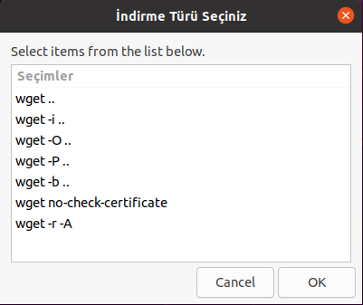

# Wget Komutu Görsel Arayüzü
## Özet
Bu proje  BTU-Linux Araçları ve Kabuk Programlama dersi için yaptığım Shell Programalama ödevidir.

## Proje Amacı
wget komutunu değişik parametrelerle çalıştıran shell scriptine zenity kullanarak görsel bir arayüz oluşturulmuştur.

# Uygulama Görüntüleri ve Özellikleri

- İlk olarak wget komutunu hangi parametre ile calistirmak istediginizi sectiginiz bir secim ekranı geliyor. Buradan istediginiz durumu seçip OK'a basarak devam ediyoruz.

 

- İlk seçenek olan parametresiz secenegi direkt olarak kullanıcıdan bir link istiyor ve girilen linki direkt olarak wget komutuyla indiriyor.
- İndirme işlemi tamamlandığında kullanıcıya bilgi verme amaçli bir info ekranı gösterilir.

- Daha sonrasında kullanıcıya devam edip etmek istemediği sorulur eğer devam seçeneği seçilirse kullanıcı yine seçim ekranına yönlendirilir.

 

- -i parametresi seçildiğinde ise kullanıcıdan bir dosya seçmesi istenir. 
- -i parametresinde kullanılmak için oluşturulan linkler.txt isimli dosya. Bu dosya file selection ile seçildikten sonra bütün linkler indirilir(Aynı dosya dizinine). Ve sonrasında kullanıcıya info ekranı gösterilir.

 

- -o parametresi girilen linkteki dosyayı farklı bir isimle kaydetmeye yarar. Kullanıcıdan bir link istendikten sonrasında kaydedileceği isimde istenir. Dosya yeni ismiyle aynı dizine indirilir.

 

- -p parametresi girilen linkteki dosyayı farklı bir dizine kaydetmeye yarar. Kullanıcıdan bir link istendikten sonrasında kaydedileceği yeni dizinde istenir. Secil yapildiktan sonra dosya yeni dizine indirilir.

 

- -b parametresi girilen linkteki dosyayı arka planda indirmeye yarar. 
- --no-check-certificate Geçersiz bir SSL sertifikasına sahip bir ana bilgisayardan HTTPS üzerinden bir dosya indirmeye yarar

- Gerekli alanlardan boş bırakılan olursa kullanıcıya warning ekranı gösterilir.

# Kullanılanlar
- Bash Script
- Zenity
- Nano

# Kurulum ve Oynanış
## Github üzerinden indirmek

Resimdeki adımları takip ederek kodu zip olarak indirin.
Zipten çıkarınız.
Zipten çıkarılmış klasorde terminali açınız.
bash wgetapp.sh komutunu calistiniz.

# İletişim
[@MustafaErenn](https://github.com/MustafaErenn) 
[Linkedin](https://www.linkedin.com/in/mustafa-eren-9214661b3/)
